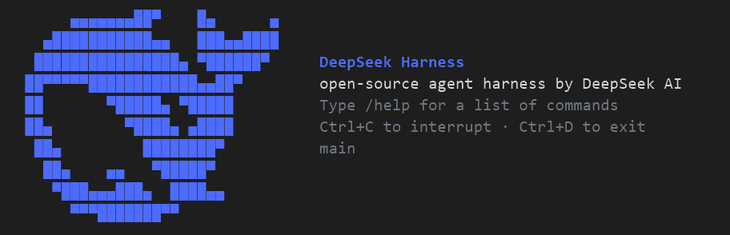

# dsh-tui

**Languages:** English · [简体中文（中文文档）](README.zh.md)

> ⚠️ **Independent third-party maintenance, not an official project.** This
> package restores, migrates, and extends the interactive terminal front door
> (`packages/ui/tui`) that DeepSeek removed before release (commit `10bb9cbf4a`,
> "cleanup: remove TUI package and legacy dsh entrypoints"). It is derived from
> that public history and is **not affiliated with, endorsed by, or
> representative of DeepSeek**; product names and marks are used nominatively.

**dsh-tui** is an interactive full-screen terminal UI for DeepSeek Harness agents: it renders the durable session transcript, drives one configured agent, and provides keyboard-driven dialogs — sent messages, assistant stream, reasoning blocks, tool cards, injected-context cards, model selection, and session resume.



## Features

The TUI surfaces the whole session: transcript, tool cards, reasoning blocks, and model switching.

- Full-screen terminal chat over a durable session transcript
- Distinct visual separation between **You** (blue), **❯ Assistant** (teal), injected **Context** cards, and tool cards, with full-width separators
- Official DeepSeek whale startup banner: the 24×24 official icon rasterized and painted in the brand's `#4D6BFE` blue, revealed row by row, with a DeepSeek Harness introduction and starter hints beside the mark
- Default **VSCode Dark+–inspired 24-bit palette** (blue `#569CD6`, teal `#4EC9B0`, cold-gray dim `#6E7681`, semantic success/warning/error), with a fallback to the adaptive ANSI theme
- Streaming assistant output with per-step timing footers
- `Ctrl+O` cycles tool-card visibility (collapsed → expanded → hidden), `Ctrl+R` toggles reasoning blocks
- `/model` selector, `/resume` picker, `/skill:<name>` invocation, `@file` completion, `/status` and `/details` diagnostics
- Installs as a dsh profile bundle via the official `dsh plugin` mechanism (`dsh.profile.bundles` layer with `dsh.bundle.patch`)

## Install & use

The package ships a built `lib/` and a `cordis.patch.yml` bundle overlay.

### As a dsh profile bundle (recommended)

```bash
# from this repository
pnpm pack --pack-destination /tmp
# create a profile, install the tarball as a plugin
dsh plugin --profile tui add /tmp/dsh-tui-0.1.7.tgz
# boot into the interactive TUI
dsh --profile tui
```

The bundle patch also configures a `main` agent (`sessionId: main`, `provider: deepseek-official`, `model: deepseek-v4-pro`, cwd = invoking directory) on top of `@deepseek-ai/dsh-base`; rows whose ids no longer exist in a future base are skipped with a Loader warning by design.

### As a dependency

```bash
npm install dsh-tui
# or from a tarball
npm install dsh-tui-0.1.7.tgz
```

Then reference it in a dsh profile patch:

```yaml
- insert:
    - id: tui-prompt
      name: 'dsh-tui/prompt'
    - id: ui-tui
      name: 'dsh-tui'
```

### Requirements

- Node.js ≥ 22 and an interactive TTY (the plugin refuses pipes: *"both stdin and stdout must be TTYs"*)
- Peer packages installed by the hosting dsh installation (agents, sessions, commands, user-questions, tools, llm, system-prompt, token-meter)

## Keyboard shortcuts

Most shortcuts work in the editor and in dialogs; Esc cancels the running turn.

| Key | Action |
|-----|--------|
| Enter | Send |
| Shift/Alt+Enter | Newline |
| Up/Down | Prompt history |
| Esc | Cancel the running turn |
| Ctrl+O | Cycle tool cards: collapsed → expanded → hidden |
| Ctrl+R | Toggle reasoning blocks |
| Ctrl+L | Redraw |
| Ctrl+C | Cancel while running; clear input / exit while idle |
| Ctrl+D | Exit |

## Commands

Type a command in the prompt to drive the TUI from the keyboard.

`/model [provider/]model` · `/resume` · `/skill:<name> [instructions]` · `/details [collapsed|expanded|hidden] [reasoning [on|off]]` · `/status` · `/palette` · `/help` · `/exit` `/quit`

## Configuration

The `ui-tui` row accepts the fields below; defaults apply when a field is omitted.

```yaml
- id: ui-tui
  name: 'dsh-tui'
  config:
    title: 'My Agent'
    showReasoning: true
    maxToolOutputLines: 6
    theme:
      color: true        # master color switch; false = plain text
      vscode: true       # VSCode Dark+–inspired 24-bit palette (default)
      truecolor: false   # 24-bit output; brand art uses the official DeepSeek blue
      inputPrompt: '${symbol} ${indicator}'
```

## Build from source

Build with pnpm; the bundles land in `lib/`.

```bash
pnpm install          # installs deps and the peer packages for typecheck
pnpm run build        # tsc (lib/types) + tsdown (lib/*.js)
```

The `pnpm-workspace.yaml` pins the `@deepseek-ai/dsh-*` peer packages to the exact `0.1.2-rc.1` versions — the registry only publishes prereleases, which a bare `>=0.0.1` range cannot match.

## Repository layout

Each top-level entry keeps one kind of truth.

```
src/                     migrated source (current DeepSeek Harness APIs)
lib/                     built bundles (included for drop-in use)
cordis.patch.yml         dsh bundle patch (profile layer)
legacy-launcher/         the upstream launcher glue (reference only, not built)
tests-pre-migration/     upstream test suite archive, not yet migrated (not built)
.agents/skills/           project-scoped skills for dsh sessions working in this repo
```

## Project skills

Ten project-scoped skills live under `dsh-tui/.agents/skills/`, adapted from the deepseek-harness repository's own skill set (master @ `cd5ef81481`, 2026) — repo-local, not shipped in the npm package.

A dsh session whose working directory is inside this repository auto-discovers them (project `agents/skills` root) and loads one when the task matches its description; they stay invisible in other projects.

| Skill | Purpose |
|---|---|
| `dsh-doc` | README-pair documentation standard and bilingual-line alignment |
| `dsh-prose-standard` | contract-preserving comments, docs, prompts, and copy |
| `dsh-trim-cot-leakage` | remove leaked chain-of-thought prose |
| `dsh-code-review` | PR review against this repo's actual conventions |
| `dsh-pre-push-checks` | smallest local checks before pushing (`pnpm typecheck`, `pnpm build`) |
| `dsh-merging-stacked-prs` | GitHub official stacked-PR landing flow |
| `dsh-find-simplifications` | evidence-backed simplification candidates (issue/PR/TODO) |
| `dsh-archive-agent-notes` | standby — applies only once this repo adopts an Agent Note convention |
| `dsh-translate-docs` | extended bilingual README workflow — user-invoked only (`/skill:dsh-translate-docs`) |
| `record-browser-gif` | UI demo GIFs: terminal sessions (primary) and browser/Web UI |
| `dsh-release` | release-cycle runbook: baseline bump, API migration, pack, install, tag, GitHub release |

The adapted bodies drop every deepseek-harness-specific command and relative link; the set ships together so in-skill cross-references keep resolving.

## Migrations vs. the official removal

The upstream `packages/ui/tui` predates several DeepSeek Harness API changes; this repository migrates it, including:

- `AgentLlmTarget`/`installAgentLlmTarget` → `ModelSelection`/`installModelSelection` (`dsh-agent`)
- `dsh-user-interaction` → `dsh-user-questions` (`UserQuestionService`), `dsh-compact` → `dsh-compaction`, `SkillService` → `SkillRegistry`, `SessionReferenceService` → `SessionReferenceResolver`, `SessionQueryService` → `SessionQueryEngine`, `cordis` → `@deepseek-ai/cordis`
- session event drift: `turn/end` reason shapes, `compact/*` → `compaction/*`, payload-style agent events, automatic `@` reference resolution via `agent/pre-step`
- `@earendil-works/pi-tui` upstream patch surfaced as the `frame`/`prompt` editor options and `setPrompt` (restored in the migrated `HintEditor`)
- official DeepSeek whale startup banner (rasterized from the official 24×24 icon), VSCode-inspired theme, transcript separators
- dsh baseline lifted through 0.1.2-rc.1: user-questions answerers compose on the `user-questions/request` waterfall, session reads use `snapshotEvents()`/`deriveEventMessage`, title cold reads stay in the query engine, and todo types come from `dsh-tool-todo`/`dsh-util-values`

## License

BSD-3-Clause — see [LICENSE](LICENSE). The original source is derived from the public DeepSeek Harness commit history; this repository is an independent re-packaging and carries no official status.


